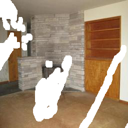
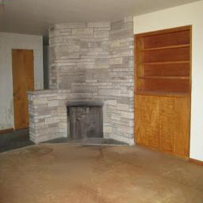
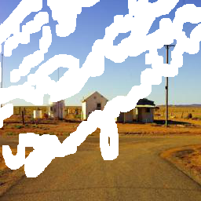
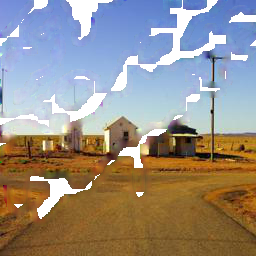
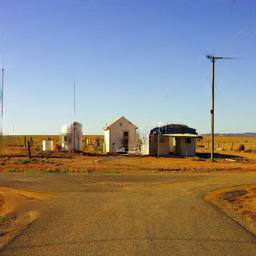

# Inpainting_FRRN
This repository is the pytorch implementation of Progressive Image Inpainting with Full-Resolution Residual Network ([arxiv](https://arxiv.org/abs/1907.10478))

## Introduction
We propose FRRN which shows that residual sturcture is particularly suitable for progressive inpainting strategy. Our spatial progressive inpainting model is composed of eight dilation modules. Each dilation module contains two full-resolution residual blocks. This architecture is designed to accurately control the mask-updating process and inpainting quality. Full-resolution branch is also helpful to determine the dilation stride of each FRRB and simultaneously improve final performance.

## Visual Results
<p float="left">
    
    
    
</p>
<p float="left">
    
    
    
</p>

## Code Structure
This is the dirty version for our implementation. Part of the code is modified from [EdgeConnect](https://github.com/knazeri/edge-connect). We note that partialconv2d.py is also modified based on the released version of [PartialConv](https://github.com/NVIDIA/partialconv).

You can generate flist files of data through the script located in ./flist.
```bash
cd ./flist
bash flist.sh
```

## Performance
If you are willing to try different loss weights, you may get even higher PSNR value (e.g., you can decrease the weight of adversarial loss). However, we manage to achieve the balance between qualitative results and quantitative results. 

## Usage
To train your own parameters of FRRN, you can enter
```bash
cd ./src
python main.py --skip_training=False --gpu_id=0,1
```

To evaluate your trained model, you can enter
```bash
cd ./src
python main.py --skip_training=False --RESUME=True --gpu_id=0,1
```

We here provide our pre-trained model on Places2 dataset which performs closed to our reported statistics. We put it in ./save_models.
If you use this pre-trained weights of model, you can 
```bash
cd ./src
python main.py --skip_training=False --RESUME=True --gpu_id=0
```


## Some Details
Our codes only resize input images to 256*256 resolution. So if you are curious about our network's performance on larger resolution, you should reset the related parameters.