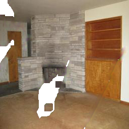

# Inpainting_FRRN
This repository is the pytorch implementation of Progressive Image Inpainting with Full-Resolution Residual Network ([arxiv](https://arxiv.org/abs/1907.10478))

## Introduction
We propose FRRN which shows that residual sturcture is particularly suitable for progressive inpainting strategy. Our spatial progressive inpainting model is composed of eight dilation modules. Each dilation module contains two full-resolution residual blocks. This architecture is designed to accurately control the mask-updating process and inpainting quality. Full-resolution branch is also helpful to determine the dilation stride of each FRRB and simultaneously improve final performance.

## Visual Results

    
    
    

    
    
    

## Release Timeline
* Release pre-trained model for evaluation recently.
* Release the whole cleaned codes before 15th, November.